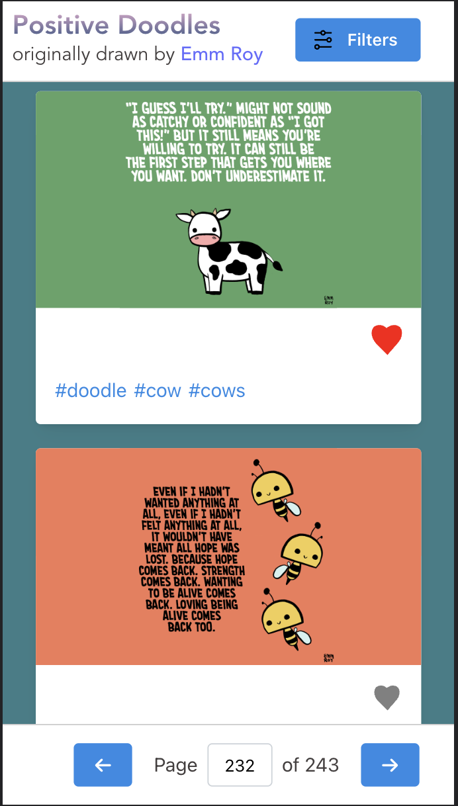
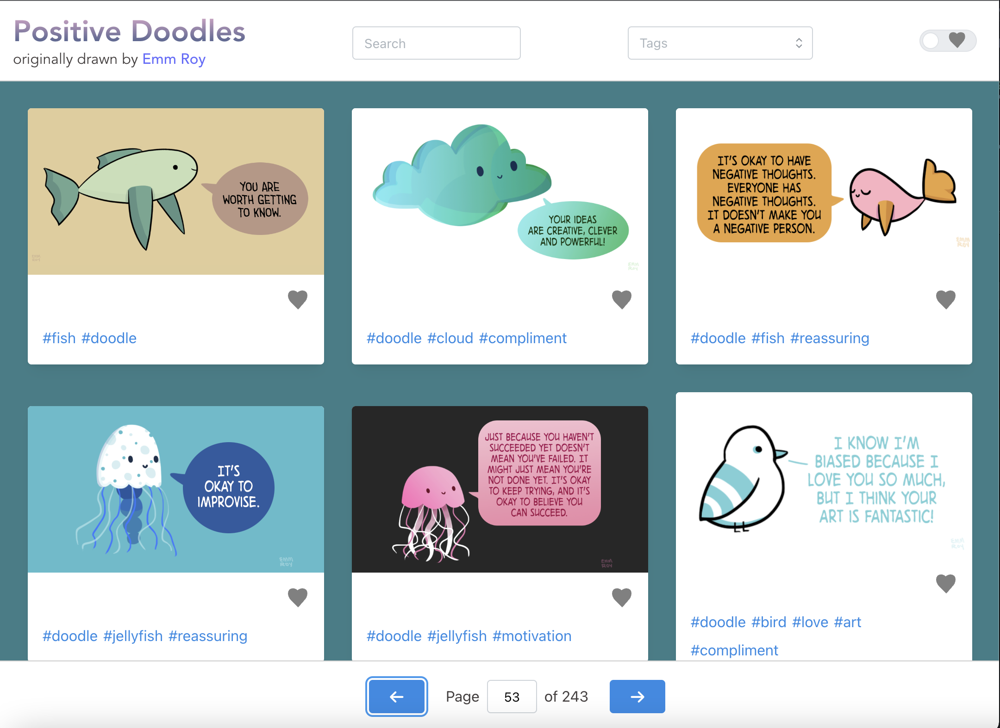

# Positive Doodle View

Web/mobile view that has positive doodles, originally drawn by Emm Roy. It has functionality to search for doodles by tags and words. Users also have the ability to save doodles to local storage and view them later. This utilizes the [Positive Doodle API](https://github.com/nguyennick197/positive-doodle-api).

## Built With
- [React](https://reactjs.org/)
- [TypeScript](https://www.typescriptlang.org/)
- [Mantine](https://mantine.dev/)
- [Emotion](https://emotion.sh/docs/styled)

## Contributors 
 - [Nick Nguyen](https://github.com/nguyennick197)

 ## Screenshots

